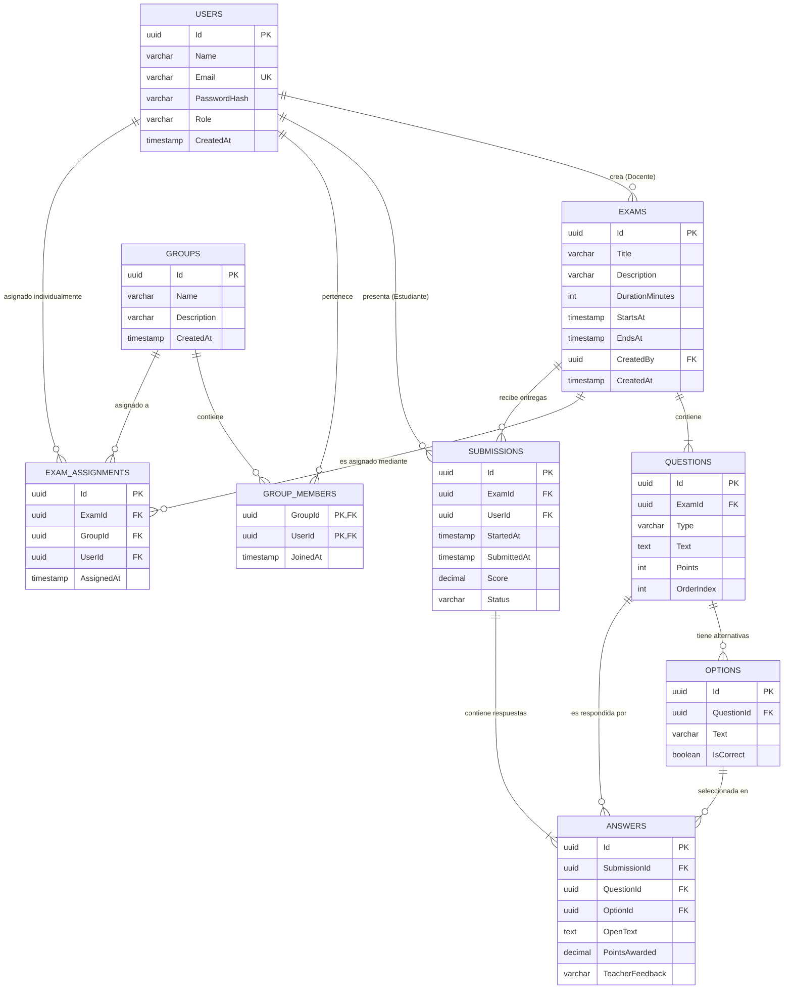
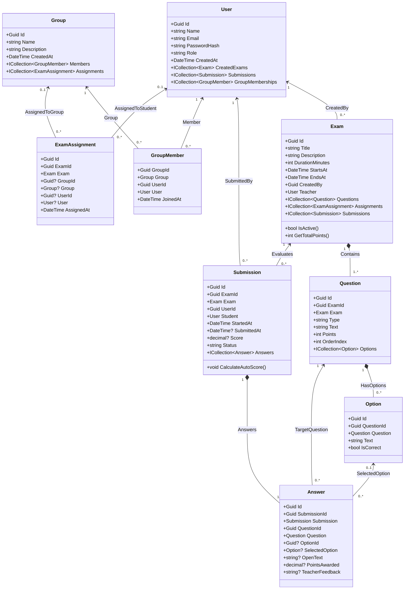
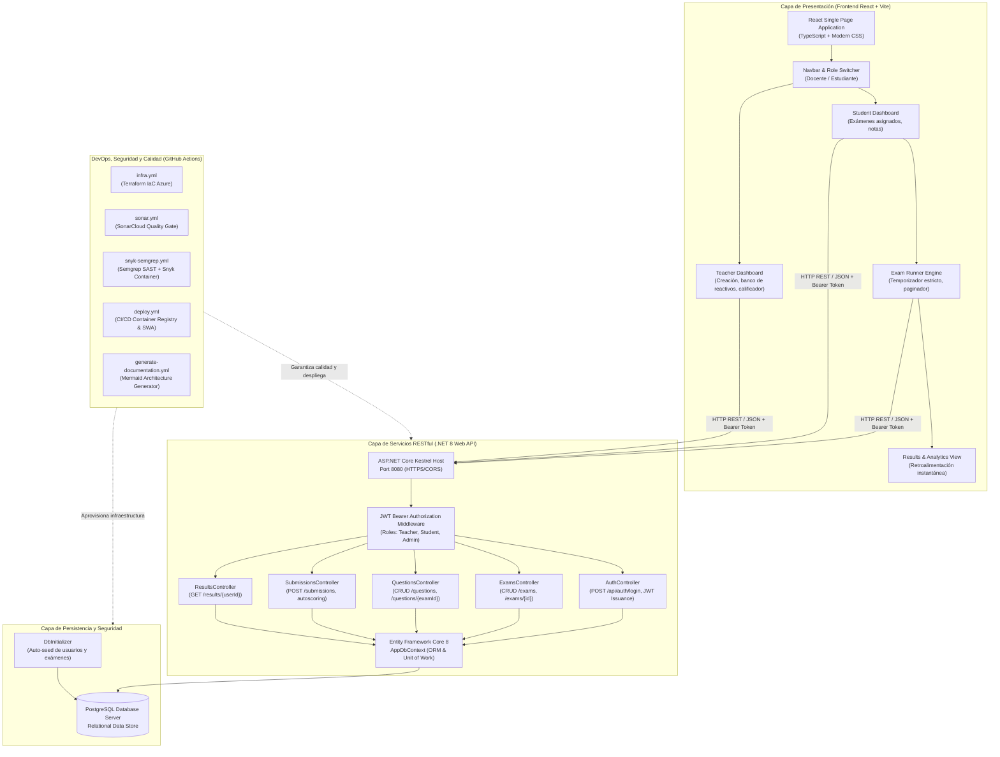

# Documentación de Arquitectura — Plataforma de Exámenes en Línea

Este compendio documental ha sido generado automáticamente para cumplir con los estándares de diseño de software y auditoría de infraestructura.

---

## 1. Diagrama Entidad-Relación (DER)
Representa el modelo de datos relacional implementado en PostgreSQL para soportar bancos de preguntas, asignaciones y entregas de exámenes.



---

## 2. Diagrama de Clases del Dominio
Ilustra el modelo de dominio orientado a objetos en .NET 8, sus propiedades y relaciones de cardinalidad.



---

## 3. Diagrama de Componentes del Sistema
Muestra la interacción desacoplada entre la capa de presentación SPA (React), la capa de servicios RESTful (.NET 8 Web API) y la base de datos relacional.



---

## 4. Diagrama de Despliegue en la Nube
Detalla la infraestructura como código aprovisionada mediante Terraform en Microsoft Azure, los contenedores seguros y los pipelines de integración y despliegue continuo.

```mermaid
flowchart TB
    subgraph DeveloperWorkstation["Entorno de Desarrollo & Repositorio GitHub"]
        Dev["Desarrollador / Alumno"]
        GitRepo["GitHub Repository<br/>(Código .NET 8, React, Terraform, Workflows)"]
        GHActions["GitHub Actions CI/CD Runners"]
    end

    subgraph AzureCloud["Microsoft Azure Cloud Infrastructure (eastus2)"]
        subgraph ResourceGroup["Resource Group: rg-exams-platform-prod"]
            ACR["Azure Container Registry (ACR)<br/>acrexams*.azurecr.io"]
            
            subgraph ContainerAppEnv["Azure Container Apps Environment"]
                AppBackend["Azure Container App: ca-exams-api<br/>.NET 8 Web API (Alpine Linux, Non-Root)<br/>Port 8080 (CPU: 0.5, RAM: 1.0Gi)"]
            end

            PostgresFlexible["Azure Database for PostgreSQL Flexible Server<br/>v16 (B_Standard_B1ms, 32GB Storage)"]
            
            StaticWebApp["Azure Static Web Apps (SWA)<br/>React 18 + Vite (Dist CDN Global)"]
            
            LogAnalytics["Azure Log Analytics Workspace<br/>Monitoreo y Métricas de Diagnóstico"]
        end
    end

    subgraph SecurityGateways["SaaS de Seguridad y Calidad"]
        SonarCloud["SonarCloud.io<br/>(0 Bugs, 0 Vulnerabilities, 0 Hotspots)"]
        SemgrepSaaS["Semgrep Engine (SAST OWASP)"]
        SnykSaaS["Snyk Container & Dependency Security"]
    end

    Dev -->|git push origin main| GitRepo
    GitRepo -->|Trigger Workflows| GHActions

    GHActions -->|sonar.yml| SonarCloud
    GHActions -->|snyk-semgrep.yml| SemgrepSaaS
    GHActions -->|snyk-semgrep.yml| SnykSaaS
    GHActions -->|infra.yml (Terraform)| ResourceGroup
    GHActions -->|deploy.yml (Docker Push)| ACR
    GHActions -->|deploy.yml (SWA Deploy)| StaticWebApp
    ACR -->|Pull Container Image| AppBackend
    AppBackend -->|SSL Connection Pool| PostgresFlexible
    AppBackend -->|Logs & Métricas| LogAnalytics

    Clients["Estudiantes & Docentes (Navegador Web)"] -->|HTTPS| StaticWebApp
    StaticWebApp -->|API Calls (HTTPS / Bearer)| AppBackend
```

---

## 5. Diccionario de Datos Completo
Consulte el archivo detallado con todas las especificaciones de tipos, índices y restricciones en [`data-dictionary.md`](./data-dictionary.md).